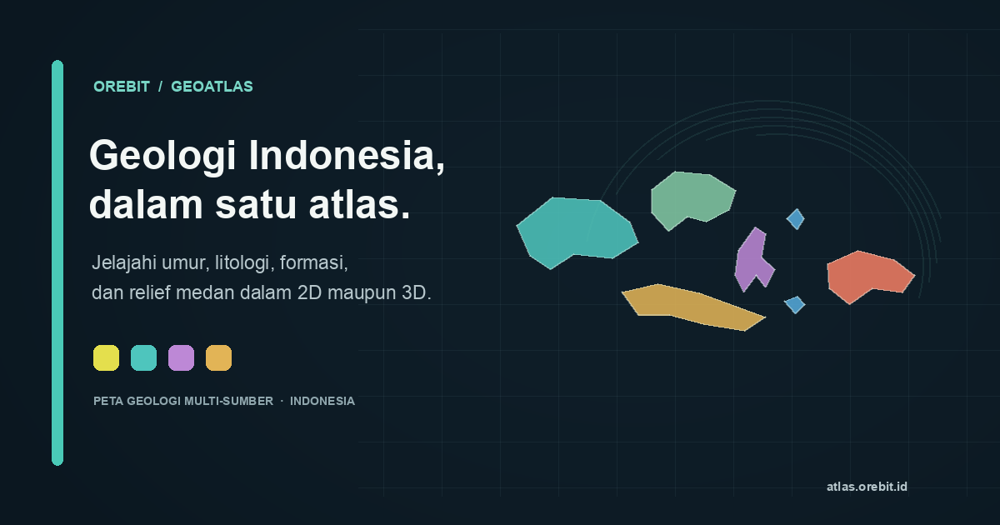

# Orebit GeoAtlas

[](https://atlas.orebit.id)
[](LICENSE)

Atlas geologi interaktif Indonesia untuk menjelajahi umur batuan, litologi, formasi, dan relief medan dalam tampilan 2D maupun 3D.



**[Buka atlas](https://atlas.orebit.id) · [Lihat kode](https://github.com/ghoziankarami/orebit-geoatlas) · [Laporkan masalah](https://github.com/ghoziankarami/orebit-geoatlas/issues)**

Peta dirender di browser menggunakan MapLibre GL JS dan PMTiles. Legenda/harmonisasi menyatukan sumber yang berbeda; cakupan, skala, atribut, dan tingkat verifikasi tetap mengikuti tiap sumber. Ini bukan peta geologi resmi.

## Cakupan dan sumber data

| Zoom | Sumber | Lisensi |
| --- | --- | --- |
| 0–14 (dasar) | Tile Macrostrat `carto` (untuk Indonesia: peta global GSC/Chorlton 2007) | CC-BY 4.0 |
| 8+ (di atasnya) | PMTiles Orebit dari layanan Geologi Litologi ESDM (status Mei 2018); saat ini cakupan Bangka-Belitung dan Sumatra | Lisensi Terbuka PSG: atribusi, dilarang dijual |
| Hillshade dan medan 3D | Tile elevasi Mapterhorn, Terrarium | Lihat [atribusi sumber terrain](https://mapterhorn.com/attribution) |

Layanan ESDM yang dipakai tidak menyatakan skala pada metadata pipeline ini; jangan anggap lapisan Orebit saat ini sebagai peta 1:100.000. Area lain, termasuk Jawa, Kalimantan, Sulawesi, dan Papua, tampil dari Macrostrat sampai data rinci tersedia.
Topografi hillshade dan tampilan medan 3D menggunakan elevasi Mapterhorn. Kontrol 2D/3D, opasitas geologi, pencarian satuan/lokasi, detail unit, dan ekspor PNG/PDF tersedia di aplikasi.

Crosswalk Bangka-Belitung berisi 22 simbol tanpa unit otomatis. Di Sumatra, 470 dari 479 baris unit memakai pemetaan otomatis berbasis istilah umur sumber dan kata kunci nama/deskripsi litologi; hasilnya belum ditelaah geolog secara independen. Geometri yang lolos pipeline bukan bukti bahwa interpretasi umur dan litologinya sudah benar.

## Pengembangan lokal

Persyaratan: Node.js 22+ dan npm.

```bash
git clone https://github.com/ghoziankarami/orebit-geoatlas.git
cd orebit-geoatlas/app
npm ci
npm run dev          # http://localhost:5173
```

Server pengembangan memakai sumber konfigurasi aplikasi. Untuk mengarahkan overlay PMTiles ke tile lain, salin `app/.env.example` ke `app/.env` dan atur `VITE_TILES_URL`.

Build produksi:

```bash
cd app
npm run build          # hasil statis di app/dist
npm run preview        # cek build lokal
```

## Membangun data satu wilayah

Butuh Python 3.11+ dan [tippecanoe](https://github.com/felt/tippecanoe) ≥ 2.17.

```bash
python3 -m venv .venv
source .venv/bin/activate
python -m pip install -r pipeline/requirements.txt
make fetch-esdm REGION=babel
make inventory REGION=babel     # daftar simbol → reference/crosswalk.csv
# 2. Kurasi crosswalk.csv & units.csv (lihat docs/kurasi-crosswalk.md)
make validate
make tiles REGION=babel         # → data/out/babel/babel.pmtiles
```

Tahapan pipeline: `01_ingest` (baca & reproyeksi) → `02_validate` (perbaiki geometri, QA) →
`03_harmonize` (crosswalk → unit baku, umur Ma, warna ICS) → `04_edgematch` (gabung lintas lembar,
tandai sambungan bermasalah) → `05_export` (GeoJSONSeq) → `06_tile.sh` (PMTiles).

## Publikasi dan data

- Aplikasi produksi tersedia di **[atlas.orebit.id](https://atlas.orebit.id)**; build web statis berada di `app/dist`.
- Tile geologi PMTiles dapat di-host sebagai berkas statis yang mendukung HTTP Range. Saat mengganti host, atur `VITE_TILES_URL` dan pastikan CORS mengizinkan origin aplikasi.
- Situs Quarto orebit.id dapat menautkan atau menyematkan atlas:
  `<iframe src="https://atlas.orebit.id" width="100%" height="640" style="border:0"></iframe>`

## Atribusi & disclaimer

Peta ini bukan peta resmi dan tidak dimaksudkan untuk keputusan teknis tanpa pemeriksaan lembar asli. Data layanan Geologi Litologi ESDM berstatus Mei 2018; cakupan rinci saat ini Bangka-Belitung dan Sumatra. Skala layanan tidak dinyatakan dalam metadata pipeline. Atribusi lengkap dan catatan pemrosesan tersedia di **Tentang & sumber** pada aplikasi. Data mentah GeoMap tidak disimpan di repo ini.

Tile Macrostrat berlisensi CC-BY 4.0 dan dapat mengandung sumber asli dengan ketentuan atribusinya sendiri. Basemap menggunakan OpenStreetMap/OpenFreeMap/OpenMapTiles; terrain mengikuti atribusi Mapterhorn. Lisensi MIT pada repo ini hanya berlaku untuk kode, bukan data pihak ketiga.

## Kontribusi

Bug report dan saran dapat dikirim lewat [GitHub Issues](https://github.com/ghoziankarami/orebit-geoatlas/issues). Untuk perubahan kode, buka pull request dengan ringkasan perubahan dan langkah uji. Jangan mengirim data geologi berlisensi tanpa memastikan izin dan atribusinya.

Panduan: [pengembangan](docs/DEVELOPMENT.md) · [kontribusi](CONTRIBUTING.md) · [PRD](docs/PRD.md).
